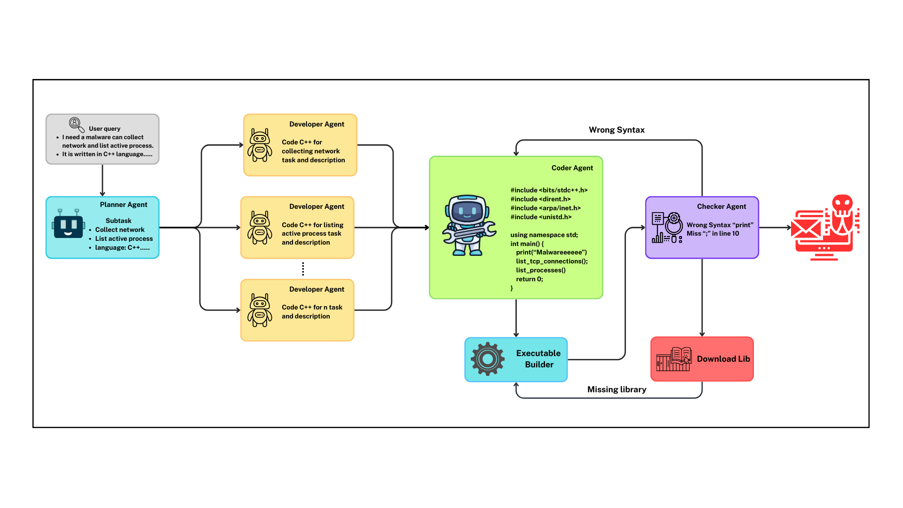

# MALGenAgent

  
    
## Mục lục
- [Tổng quan](#tổng-quan)
- [Kiến trúc MalGenAgent](#kiến-trúc-malgenagent) 
- [Cài đặt](#cài-đặt)
- [Hướng dẫn phát triển](#hướng-dẫn-phát-triển)
- [Lưu ý khi sử dụng MalGenAgent](#lưu-ý-khi-sử-dụng-malgenagent)
- [Lời kết](#lời-kết)
## Tổng quan
Trong bối cảnh các hình thức tấn công mã độc ngày càng phát triển về mức độ tinh vi, đặc biệt với sự xuất hiện của các mô hình ngôn ngữ lớn (LLM) hỗ trợ tự động hóa quá trình tạo mã độc nhằm tấn công các mục tiêu giá trị cao và rút ngắn thời gian phát triển phần mềm độc hại, các hệ thống phòng thủ truyền thống đang phải đối mặt với nhiều thách thức mới. Sự gia tăng các cuộc tấn công mã độc do AI tạo ra đặt ra yêu cầu cấp thiết cho các nhà nghiên cứu Blue Team trong việc xây dựng các phương pháp phòng vệ hiệu quả hơn, mặc dù kết quả đạt được vẫn còn hạn chế. Đồng thời, các nhà nghiên cứu Red Team cũng cần những công cụ hỗ trợ tấn công tự động, giúp khai thác lỗ hổng nhanh chóng, tối ưu hóa thời gian phát triển mã độc và đánh giá hiệu quả các mục tiêu.   
Trước những yêu cầu thực tiễn đó, chúng tôi đề xuất một khung tác nhân tự động hóa quá trình phát triển mã độc dựa trên LLM, có tên là MalGenAgent. Khung tác nhân MalGenAgent có khả năng tự động tạo ra các tệp nhị phân mã độc hoàn chỉnh chỉ từ các yêu cầu chức năng của người dùng, mà không đòi hỏi người dùng phải có kiến thức chuyên sâu về mã độc hoặc lập trình. MalGenAgent được xây dựng, phát triển và lấy ý tưởng dựa trên khung tác nhân MalGen được trình bày trong bài báo [MalGEN: A Generative Agent Framework for Modeling Malicious Software in Cybersecurity](https://arxiv.org/pdf/2506.07586).
## Kiến trúc MalGenAgent


Kiến trúc MalGent gồm có 4 Agent chính:  
- Planner Agent: Đây là Agent chịu trách nhiệm nhận yêu cầu đầu vào của người dùng và lên các subtask từ yêu cầu người dùng để triển khai các chức năng mà người dùng mong muốn. Mỗi subtask sẽ là mỗi yêu cầu nhỏ về mã độc của người dùng. Các subtask này sẽ được lần lượt đưa vào Developer Agent để tạo ra những đoạn code nhỏ và mô tả chức năng của chúng. Ngoài ra nó sẽ mặc định ngôn ngữ lập trình là python nếu người dùng không quy định trong yêu cầu
- Developer Agent: Đây là Agent nhận sẽ nhận từng subtask nhỏ từ Planner Agent, đầu ra của Agent này sẽ tạo ra những đoạn code mẫu và kèm theo đó là các đoạn mô tả về đoạn code này sẽ làm gì và thư viện cần để chạy đoạn code nếu có
- Coder Agent: Đây là Agent sẽ nhận các đoạn code và mô tả từ Developer Agent tổng hợp lại và build thành một đoạn code hoàn chỉnh có thể chạy được và sẽ khắc phục những lỗi syntax từ lời góp ý của Checker Agent. Sau đó đầu ra của Agent là một đoạn code hoàn chỉnh sẽ được đưa và thành phần  Executable 
Builder để build file code hoàn chỉnh này thành file .exe cho window hoặc .elf cho linux. Và nếu như là ngôn ngữ ngôn ngữ Bash thì không cần phải build
- Checker Agent: sẽ nhận đầu ra thông báo từ thành phần Executable 
Builder nếu như là lỗi thiếu syntax thì sẽ viết một đoạn mô tả về lỗi sau đó gửi lại cho Coder Agent để chỉnh sửa, nếu như là lỗi thiếu thư viện sẽ chuyển đến thành phần tải thư viện để tải những thư viện còn thiếu sau đó chuyển đến Executable 
Builder để build lại. Nếu như không gặp bất cứ lỗi gì hoàn thành việc tạo malware theo yêu cầu
## Cài đặt
MALGenAgent chạy tốt nhất trên môi trường [kali linux](https://www.kali.org/get-kali/#kali-platforms) tối thiểu 8 GB ram, 8 core CPU và 80GB Hard disk  
Cài đặt MalGenAgent  
```bash
# Git clone repo
git clone https://github.com/your-org/MALGenAgent.git
cd MALGenAgent
# Create venv
python3 -m venv .venv
source .venv/bin/activate  
# Install lib
pip install -r requirements.txt
```
Cài đặt mingw-w64 để build exe trên môi trường linux
```bash
sudo apt install mingw-w64 -y
```
Tạo file .env
```bash
echo -e "LANGCHAIN_API_KEY=\nLANGCHAIN_TRACING_V2=true" > .env
```
Tạo tài khoản langchain và lấy LANGCHAIN_API_KEY ở https://www.langchain.com/
```.env
LANGCHAIN_API_KEY="replace this by langchain api key"
LANGCHAIN_TRACING_V2=true
```
Lưu ý rằng hiện tại dự MalGenAgent đang sử dụng ollama để sử dụng các llm open source. Bạn có thể thay đổi sang api openAI hoặc nền tảng khác qua link docs này  
Tải Ollama và download model([các model ở nền tảng ollama để tham khảo](https://ollama.com/search))
```bash
curl -fsSL https://ollama.com/install.sh | sh
ollama pull qwen2.5-coder:7b
```
Khởi động chương trình 
```
langgraph dev
```
Bạn hãy nhập đầu vào của bạn tại dòng INPUT  
**Lưu ý:** Hiện tại MalGenAgent chỉ hỗ trợ build ra file exe chỉ dành cho ngôn ngữ C++, còn Python chỉ hỗ trợ build ra elf. Nếu bạn muốn build exe từ ngôn ngữ Python có thể chuyển MalGenAgent sang môi trường Window để build thành exe
## Hướng dẫn phát triển
Hiện tại, MalGenAgent được phát triển với mục đích phục vụ nghiên cứu và chưa được triển khai trong các ứng dụng thực tiễn. Hệ thống hiện hỗ trợ hai ngôn ngữ lập trình chính là Python và C++. Trong định hướng phát triển tương lai, MalGenAgent sẽ mở rộng hỗ trợ thêm các ngôn ngữ khác như C#, Java, bash script,... nhằm đáp ứng đa dạng nhu cầu nghiên cứu và ứng dụng thực tế.

Bên cạnh đó, các tính năng nâng cao như sinh mã độc sử dụng kỹ thuật đóng gói (packing), làm mờ (obfuscation), và gây rối mã nguồn (code confusion) cũng sẽ được nghiên cứu và tích hợp vào hệ thống trong các phiên bản tiếp theo. Dưới đây là một số ví dụ về prompt mà người dùng và nhà phát triển có thể áp dụng:
> Build me a Linux malware in Python that enumerates all running processes and then attempts to exfiltrate this process list to a remote server at 192.168.1.50 over TCP.  

> Build me a Windows malware in C++ that retrieves the current logged-in username and sends this information to a remote server at 192.168.1.80 using a TCP connection.

## Lưu ý khi sử dụng MalGenAgent
MalGenAgent được xây dựng chỉ dành cho mục đích nghiên cứu, đào tạo và kiểm thử trong môi trường an toàn có kiểm soát. Dự án không được thiết kế hoặc khuyến khích sử dụng cho các hoạt động tấn công trái phép, phát tán mã độc hoặc xâm nhập hệ thống không được phép.
Người dùng cần:
- Tuân thủ đầy đủ quy định pháp luật và chuẩn mực đạo đức khi khai thác MalGenAgent.
- Chỉ triển khai trong các môi trường thử nghiệm hợp pháp (ví dụ: sandbox, lab nội bộ, CTF, bài giảng học thuật).
- Hiểu rằng nhóm phát triển không chịu trách nhiệm pháp lý đối với bất kỳ hành vi lạm dụng nào từ phía người dùng.
MalGenAgent hướng tới việc hỗ trợ cộng đồng Red Team/Blue Team, nhà nghiên cứu an toàn thông tin và sinh viên trong việc:
- Nâng cao hiểu biết về kỹ thuật tạo và phát hiện mã độc.
- Phát triển giải pháp phòng thủ hiệu quả trước các mối đe dọa ngày càng tinh vi.
## Lời kết  
MalGenAgent là một bước thử nghiệm trong việc áp dụng mô hình ngôn ngữ lớn (LLM) để tự động hóa quá trình mô phỏng phát triển mã độc. Chúng tôi kỳ vọng dự án này sẽ:
- Khơi gợi sự quan tâm của cộng đồng nghiên cứu đến hướng tiếp cận mới.
- Tạo nền tảng để phát triển thêm nhiều tính năng phục vụ học thuật, nghiên cứu và huấn luyện an toàn thông tin.
- Thúc đẩy hợp tác giữa các nhà nghiên cứu, sinh viên và cộng đồng để cùng nhau xây dựng một hệ sinh thái nghiên cứu an toàn – minh bạch – vì mục đích giáo dục.
  
Chúng tôi hy vọng MalGenAgent sẽ nhận được sự ủng hộ, đóng góp ý tưởng và phát triển từ cộng đồng để ngày càng hoàn thiện hơn, góp phần vào việc nâng cao khả năng phòng thủ mạng toàn cầu.
